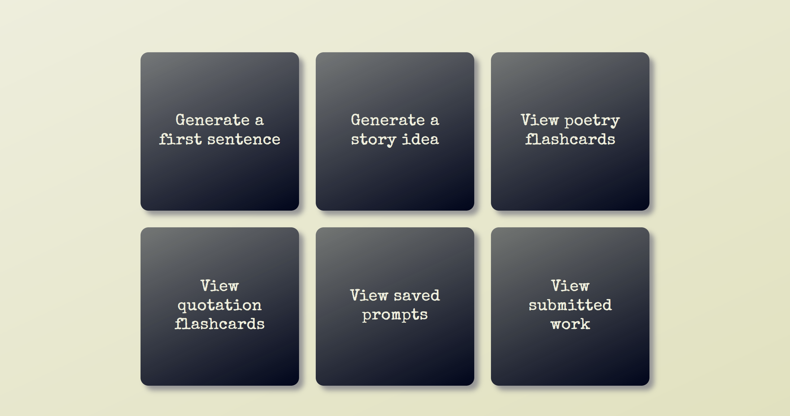
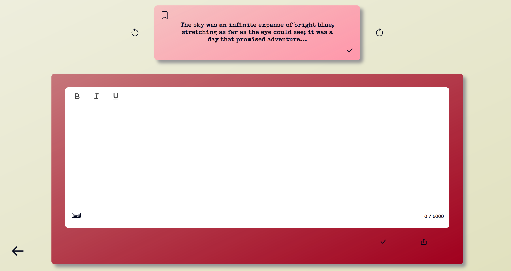
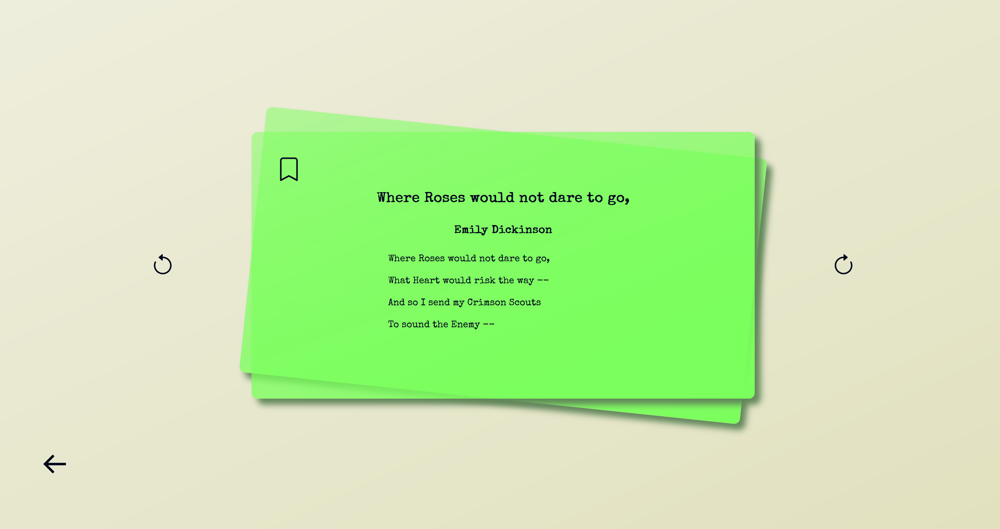
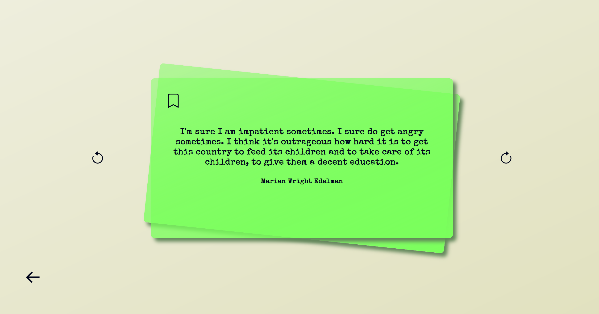
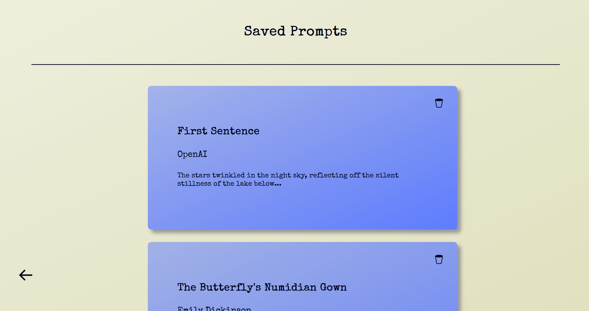
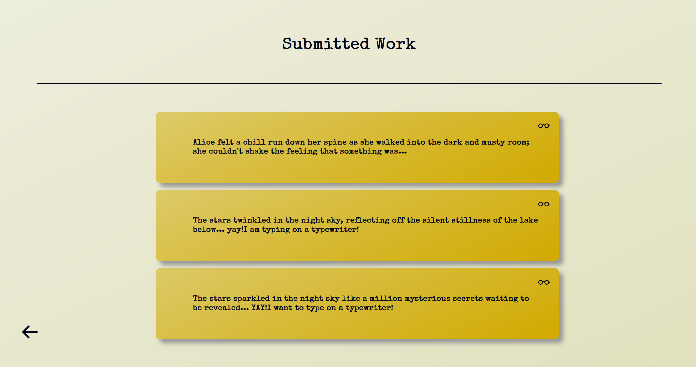

# Writing Block

Writers often feel defeated when they cannot instantly overcome writer’s block and find a source of immediate inspiration. Until now, writers just haven’t had access to effective tools that integrate different sources of inspiration and allow them to practice writing all in one place.

To solve this problem, I’ve created an application, Writing Block, which brings together different sources of inspiration to help any writer out of a rut in a fun and appealing way.

This application gives users access to 4 sources of inspiration, 4 different kinds of prompts that users can choose to work from or save for later. Using the OpenAI API, the application allows users to generate a first sentence for a story or generate a story idea. Using the PoetryDB API, users can randomly generate short poems from renowned poets, in the form of flashcards, to give them fresh inspiration. The Quotes API allows users to generate a flashcard with a completely random quotation to act as impetus for a new idea or simply as general motivation.

Try out Writing Block as a solution to your writer’s block.

[Video Demonstration](https://www.youtube.com/watch?v=PfDDQY3-J8s)

## User interface

### Homepage

<figure>
    
</figure>

### Generate a first sentence

<figure>
    
</figure>

### Generate a story idea

<figure>
    
</figure>

### Poetry flashcards

<figure>
    
</figure>

### Quotation flashcards

<figure>
    
</figure>

### View saved prompts

<figure>
    
</figure>

### View submitted work

<figure>
    
</figure>

## Getting started

### Requirements

- OpenAI Key

### Server
```
cd server
```
```
npm i
```
```
node index.js
```
If you have successfully connected to the server and database, the following message will show in the terminal:
"Server listening at <http://localhost:3001>. Successfully connected to database."

## Client
```
cd client
```
```
npm i
```
```
cd src
```
```
npm start
```
You can now view client in the browser at <http://localhost:3000>.

## Tech stack

I’ve chosen technologies that effectively allow me to bring this creative writing experience to the user, using Mongoose for MongoDB as my database, to store prompts and save pieces of writing, Koa as my backend framework, React as my frontend framework, and the Quill rich text editor for React, to enable users to embolden, italicize and underline their text on the application itself:

- Mongoose for MongoDB
- Koa
- React
- Quill
- OpenAI API
- PoetryDB API
- Quotes API

## Contributors

- [Philippa Payne](https://github.com/P-C-R-P)


## Sources

- [Typewriter sounds by BMacZero](https://freesound.org/people/BMacZero/sounds/160678/)
- [Typewriter ding by stubb](https://freesound.org/people/_stubb/sounds/406243/)
